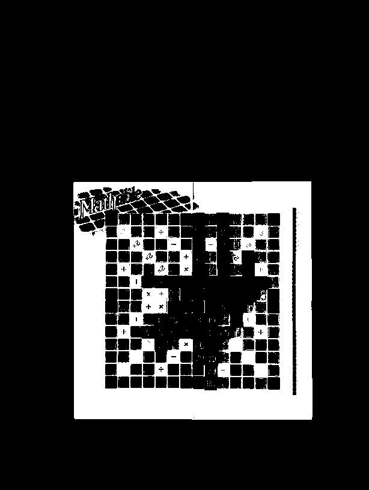
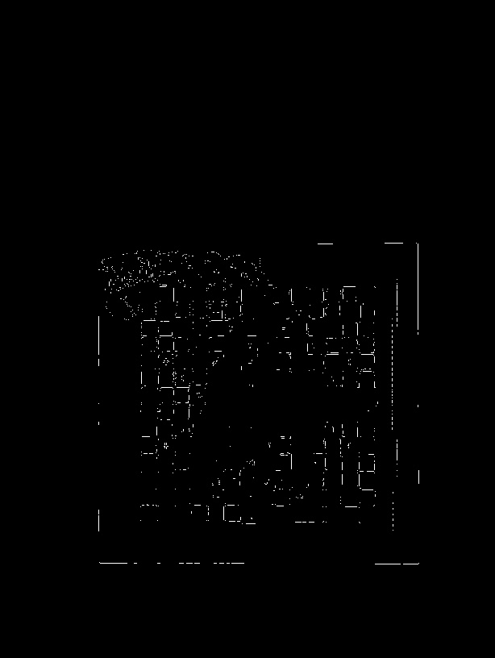
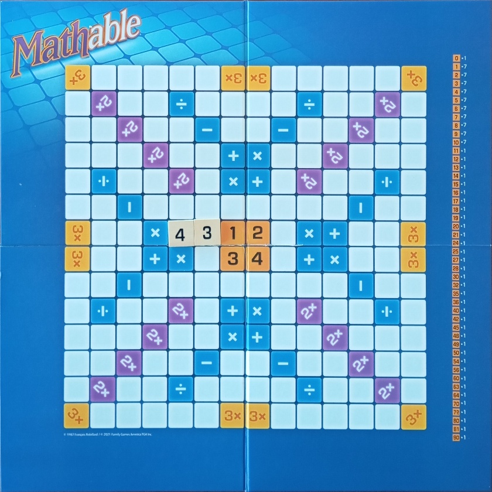
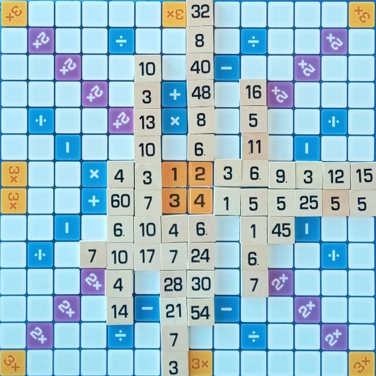
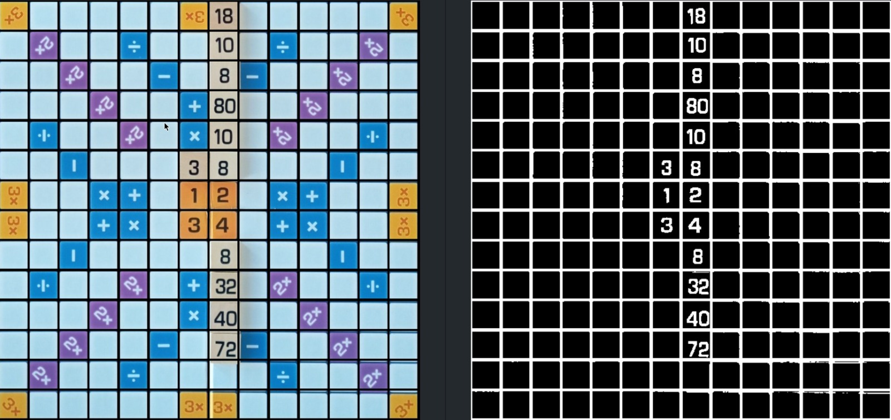
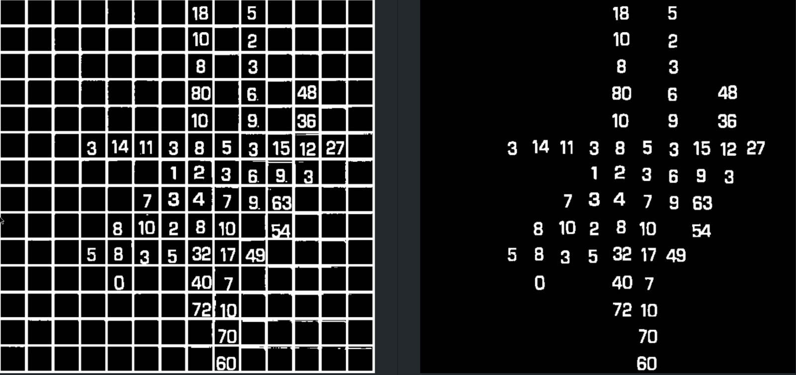
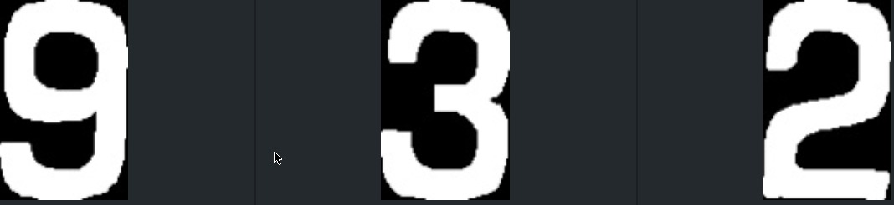

# Mathable Algorithm Description

## 1. Board Detection - extract_board
The first step is to convert the image from BGR format to HSV format.
HSV is more suitable for color-based processing because it separates the color tone (hue) from brightness and intensity.

I then define an upper and lower bound for the blue color (which is the background of the board). These bounds are used to create a mask that isolates the board from the rest of the image.

```py
color_lb, color_ub = np.array([100, 50, 50]), np.array([140, 255, 255])
mask = cv.inRange(hsv_image, color_lb, color_ub)
```

The resulting mask image is shown below:


Once the board is isolated in the mask, the edges are highlighted using the Canny edge detection algorithm.

The resulting edges are shown below:


The largest contour detected is the the Mathable board.
The corners (top-left, top-right, bottom-left, bottom-right) of the board are identified by analyzing the points on the contour, and a perspective warp is applied to align the board.

The resulting board is shown below:


## 2. Grid Extraction - extract_grid
After applying the perspective warp transformation, the board is aligned and resized to a static size. This makes it straightforward to crop out the areas that are not part of the grid. I determined that a margin of 14% effectively isolates the grid region:

```py
def extract_grid(image, width, height, margin_percentage):
    x_cutoff, y_cutoff = int(width * margin_percentage), int(height * margin_percentage)
    return image[y_cutoff:height - y_cutoff, x_cutoff:width - x_cutoff]
```

The resulting grid is shown below:


## 3. Grid processing
To further enhance the grid, I added vertical and horizontal lines with a thickness of 15px across the entire image. These lines effectively reduce the noise caused by the edges of the Mathable pieces, which might otherwise interfere with the detection of individual grid cells.

To enhance the grid and reduce noise caused by Mathable pieces, the following steps are applied:

### 1. Blurring:
Both median and Gaussian blurs are applied to smooth the image and minimize minor noise while preserving the structure of the grid.

```py
grid_m_blur = cv.medianBlur(grid, 5)
grid_g_blur = cv.GaussianBlur(grid_m_blur, (0, 0), 5)    
```

### 2. Sharpening
A weighted combination of the blurred images enhances the grid lines definition.
```py
grid_sharpened = cv.addWeighted(grid_m_blur, 1.2, grid_g_blur, -0.8, 0)
```

### 3. Thresholding
A binary inverse threshold with a value of ```65``` isolates the grid lines, converting the image to black-and-white.

```py
_, binary_grid = cv.threshold(grid, 65, 255, cv.THRESH_BINARY_INV)
```

### 4. Dilation
Dilation is a crucial step, ensuring that digits are well-connected and easily identifiable. After experimenting with various kernel sizes, I determined that a ```6×6``` kernel delivers the best results, effectively bridging gaps within the digits.

The result of the transformation is shown below:



## 4. Grid Cleaning - clean_grid

The final step involves cleaning the grid by identifying and retaining the two largest connected components based on their area, provided their size exceeds a predefined threshold. This ensures that only the most significant components are kept, while smaller, irrelevant components are discarded, leaving a cleaner grid for further analysis.

The result of the cleaning transformation is shown below:


## 5. Classification

In this step, the numbers in each grid cell are recognized by comparing connected components with predefined digit templates stored in the ```digits``` directory:



### Steps:
* Identify and extract connected regions in each grid cell using ```cv.connectedComponentsWithStats```
* Retain the two largest components, sorted by horizontal position to ensure correct digit order.
* Resize each component to match the dimensions of digit templates and calculates similarity using the ```Structural Similarity Index (SSIM)```.
* Combine recognized digits (e.g., 1 and 2 → 12) and return the final number.

Here is the code that implements this process:

```py
def classify_number(patch):
    num_labels, labels, stats, centroids = cv.connectedComponentsWithStats(patch, connectivity=8)
    valid_components = range(1, num_labels)
    
    if not valid_components:
        return -1
    
    largest_components = sorted(valid_components, key=lambda i: stats[i, cv.CC_STAT_AREA], reverse=True)[:2]
    largest_components.sort(key=lambda i: stats[i, cv.CC_STAT_LEFT])
    
    best_similarity, best_digit = -1, -1
    number = 0
    
    for i in largest_components:
        x, y, w, h = stats[i, cv.CC_STAT_LEFT], stats[i, cv.CC_STAT_TOP], stats[i, cv.CC_STAT_WIDTH], stats[i, cv.CC_STAT_HEIGHT]
        
        best_similarity, best_digit, best_template = -1, -1, None
        for digit in DIGIT_MAP[number]: 
            template = cv.imread(f"digits/{digit}.jpg", cv.IMREAD_GRAYSCALE)
            component = cv.resize(patch[y:y+h, x:x+w], template.shape[:2][::-1])

            similarity = (1 + ssim(template, component)) / 2
            if similarity > best_similarity:
                best_similarity = similarity
                best_digit = digit
                best_template = component
        
        number = number * 10 + best_digit
    
    return number
```

## 6. Score calculation

### OPERATIONS matrix

The hardcoded ```OPERATIONS``` matrix defines the operation available at each grid cell:
* ```+``` (addition)
* ```-``` (subtraction)
* ```*``` (multiplication)
* ```/``` (division)
* ```2``` or ```3``` (multipliers)
* ```#``` (null operation)

```py
OPERATIONS = [
    ["3", "#", "#", "#", "#", "#", "3", "3", "#", "#", "#", "#", "#", "3"],
    ["#", "2", "#", "#", "/", "#", "#", "#", "#", "/", "#", "#", "2", "#"],
    ["#", "#", "2", "#", "#", "-", "#", "#", "-", "#", "#", "2", "#", "#"],
    ["#", "#", "#", "2", "#", "#", "+", "*", "#", "#", "2", "#", "#", "#"],
    ["#", "/", "#", "#", "2", "#", "*", "+", "#", "2", "#", "#", "/", "#"],
    ["#", "#", "-", "#", "#", "#", "#", "#", "#", "#", "#", "-", "#", "#"],
    ["3", "#", "#", "*", "+", "#", "#", "#", "#", "*", "+", "#", "#", "3"],
    ["3", "#", "#", "+", "*", "#", "#", "#", "#", "+", "*", "#", "#", "3"],
    ["#", "#", "-", "#", "#", "#", "#", "#", "#", "#", "#", "-", "#", "#"],
    ["#", "/", "#", "#", "2", "#", "+", "*", "#", "2", "#", "#", "/", "#"],
    ["#", "#", "#", "2", "#", "#", "*", "+", "#", "#", "2", "#", "#", "#"],
    ["#", "#", "2", "#", "#", "-", "#", "#", "-", "#", "#", "2", "#", "#"],
    ["#", "2", "#", "#", "/", "#", "#", "#", "#", "/", "#", "#", "2", "#"],
    ["3", "#", "#", "#", "#", "#", "3", "3", "#", "#", "#", "#", "#", "3"],
]
```

### Valid Moves

A valid move is defined as a pair of adjacent grid cells (in a straight line) containing valid numbers. To determine valid moves starting from a fixed position ```[row, col]```, the algorithm checks the following:
1. The starting position ```[row, col]``` is the reference point
2. It checks the cells in four directions relative to ```[row, col]```:
* Up: ```[(row - 1, col), (row - 2, col)]```
* Down: ```[(row + 1, col), (row + 2, col)]```
* Left: ```[(row, col - 1), (row, col - 2)]```
* Right: ```[(row, col + 1), (row, col + 2)]```
3. Conditions for a valid move:
* All cells in the move must be within the grid boundaries:
```0 <= row, col < 14```
* None of the cells in the move can be empty

Here is the Python code to determine valid moves:

```py
def valid_moves(grid, row, col):
    moves = [
        [(row - 1, col), (row - 2, col)],  # Upwards
        [(row + 1, col), (row + 2, col)],  # Downwards
        [(row, col - 1), (row, col - 2)],  # Leftwards
        [(row, col + 1), (row, col + 2)],  # Rightwards
    ]

    def is_valid_move(move):
        return all(0 <= r < 14 and 0 <= c < 14 and grid[r, c] != -1 for r, c in move)

    return [move for move in moves if is_valid_move(move)]
```

### Formula

Once I have identified all valid moves for a given ```[row, col]```, the scoring mechanism depends on the content of grid ```[row, col]```
* If ```grid[row, col]``` contains one of the operations (+, -, *, /), only that specific operation is applied to calculate the score
* Otherwise, all possible operations are considered for scoring.

The formula for calculating the score is:
```Score = count * value * multiplier```

Where:

* ```count```: The total number of valid moves derived from adjacent cells
* ```value```: The numerical value present in grid[row, col]
* ```multiplier```: If ```[row, col]``` is designated to double or triple the score, the multiplier is set to ```2``` or ```3```, respectively. By default, the multiplier is set to ```1``` if no special scoring conditions apply.

Here is the Python code to calculate the score given ```[row, col]```:
```py
def calculate_score(grid, row, col, value):  
    operation = OPERATIONS[row][col]
    count = 0
    
    for move in valid_moves(grid, row, col): 
        x = grid[move[0][0], move[0][1]]
        y = grid[move[1][0], move[1][1]]
        
        operations = [OPERATIONS_MAP[operation]] if operation in OPERATIONS_MAP.keys() else OPERATIONS_MAP.values()
        for function in operations:
            if function(x, y) == value or function(y, x) == value: 
                count += 1

    return count * value * (int(operation) if operation in "23" else 1)
```